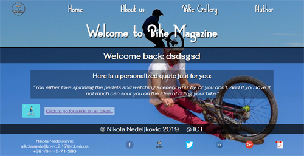
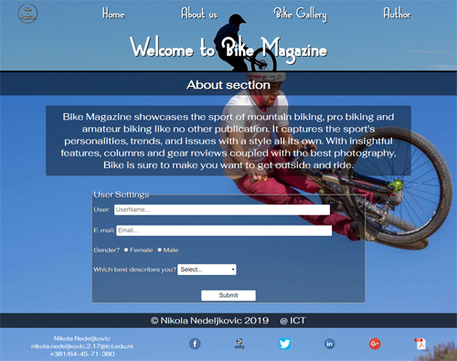
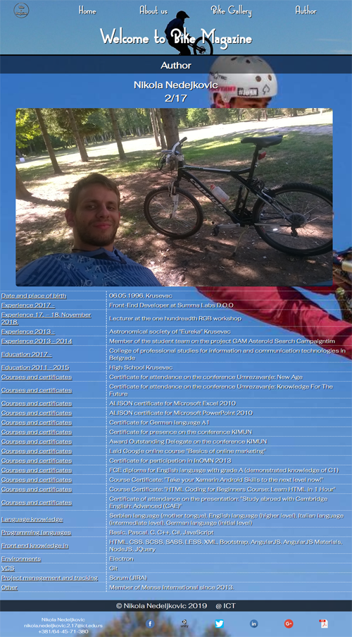
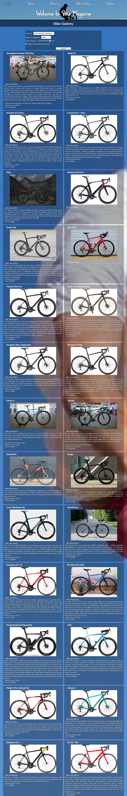

# Bike Magazine

*Fifth, responsive, website created using JavaScript and jQuery and Object JS made in my second year of studying.*

## Website Desing

### *Home page*

Home page with JS animation and text inserting using JSON and AJAX.

### *About page*

About page with user settings saved in local storage.

### *Author page*

Insering CV data via JSON and AJAX.

### *Bikes page*

Bike page with infinite scroll, working sort and filter.